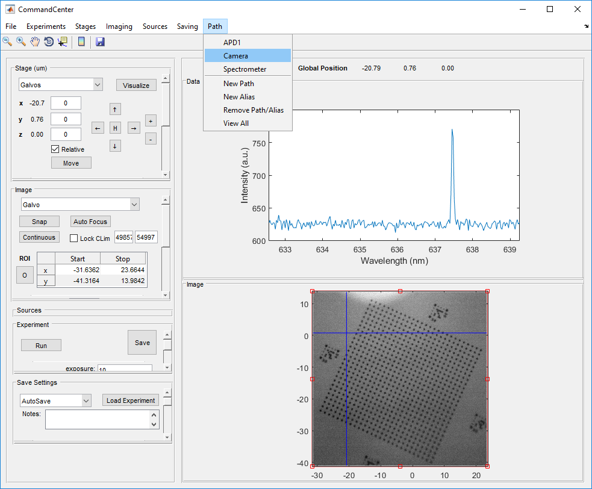
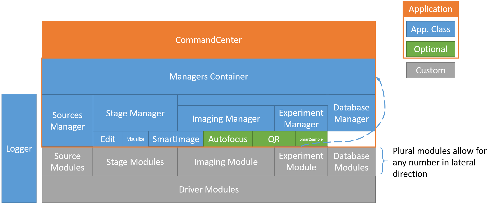

# CommandCenter

[CommandCenter](https://github.com/mwalsh161/CommandCenter/wiki "CommandCenter Wiki") is a modular experimental framework. The user can load modules from the various menus (at the top of the application) and operate them using their controls within the left side panel. All of these control containers can be adjusted in size by dragging their bottom edge, or minimized by clicking their top edge.

The two main panels on the right are designed to contain the images captured by an active _imaging_ module and data captures by a running _experiment_ module. These panels can be rearranged with options under the "File" menu and their size can be adjusted by dragging the bar between them.

The remainder of this document will cover ([see wiki for more details](https://github.com/mwalsh161/CommandCenter/wiki "CommandCenter Wiki")):
- [Saving](#saving)
- [Paths](#paths)
- [Logging](#logging)
- [Debugging](#debugging)
- [VerdiClient](#verdiclient)
- [slackAPI](#slackapi)
- [Inner Workings Intro](#commandcenter-innerworkings)

Any module (with a more complicated exception for "Drivers") are singleton classes and can always be retrieved by calling their `instance(...)` method. If it is already loaded in CommandCenter, this will simply return the existing instance that can be used elsewhere in MATLAB without creating a _new_ instance.

Modules are saved in this repo as well in their appropriate packages within the `Modules/` directory.

Not covered directly here, but CommandCenter integrates pretty tightly with a few servers intended to host hardware. The generic version of this server can is known as the [ModuleServer](https://github.com/mwalsh161/ModuleServer "ModulServer") and has an appropriate client located at `HelperFunctions/hwserver.m`. A few existing modules also talk to their own respective servers:
- [Drivers.PulseBlaster:](https://github.com/mwalsh161/CommandCenter/tree/master/Modules/%2BDrivers/%2BPulseBlaster "Repo Location")
The server for this runs as a windows service and is located in this repo.
- [Drivers.WinSpec:](https://github.com/mwalsh161/CommandCenter/blob/master/Modules/%2BDrivers/WinSpec.m "Repo Location")
This is used to interface with the winspec server to take spectra using the [Experiments.Spectrum](https://github.com/mwalsh161/CommandCenter/blob/master/Modules/%2BExperiments/Spectrum.m "Repo Location") module. This server has yet to be migrated to the [ModuleServer](https://github.com/mwalsh161/ModuleServer "ModulServer") and has its own custom [WinSpecServer](https://github.mit.edu/mpwalsh/WinSpecServer "WinSpecServer") which will require MIT credentials. The WinSpec software can be found at Princeton Instrument's [ftp server](ftp://ftp.piacton.com/Public/Software/Official/WinX32/ "Download WinSpec") (for the price of it being **free**, you must have a 32-bit OS).

## Saving
The save icon on the top menu bar will execute any "manual" saving modules ([see wiki for details](https://github.com/mwalsh161/CommandCenter/wiki/Modules#imaging "CommandCenter Wiki")) enabled and will target the `imaging` module. The save button contained within the "Experiment" panel on the left will execute the "manual" saving modules for the active experiment.

Saving modules that are designated as "autosave" will execute after any image is taken or any experiment finishes.

The data saved will contain metadata related to the git commit that is active as well as any difference in the code from that commit (e.g. the output of `git diff`). Each module will also save lots of information related to the state of the module (e.g. any non-hardcoded setting such as those defined in prefs).

See the [saving module](https://github.com/mwalsh161/CommandCenter/tree/master/Modules/%2BDatabases "Repo Location") comments for details of how and where the module will save the data.

## Paths
The path menu on the far right of the top bar allows you to define the state of various mirrors, half-wave plates or switches to allow measurement from a particular device. Imaging and experimental modules may request a particular path prior to them running. If that path exists, it will be automatically selected. If it doesn't, you will be prompted to either create it or make an alias if you already created it under a different name. If there is no way to automatically set the correct path, the superuser of that setup should add the path with a blocking dialog window to have the user manually set it and hit "ok" when ready.

## Logging
The logger (opened via the file menu or "`ctl-l`") will log various actions of loading/unloading modules as well as catch any module exceptions.  Any line of the logger can be sent to the console by double clicking. This is useful because the tracebacks will contain links to offending lines that can only be clicked in the console!

The logs contained in `CC.log` will be sent to a central server at MIT (`commandcenter-logger.mit.edu`) to aid in the development of this software.

## Debugging
You may debug as usual within CommandCenter. However, because there is a lot of error handling built up around user modules, there is a safeguard against "quitting" debug mode. **Always** proceed through debugging with "continue" and let the error handling take place.  If absolutely necessary, there is a way to override this failsafe which will be displayed to you when you attempt to quit debugging.

## VerdiClient
The purpose of this extension is to enable communication with a server that controls the laser. For now, it is hardcoded to communicate with QP Lab's [hwserver](http://qplab-hwserver.mit.edu/) (server repo [here](https://github.mit.edu/mpwalsh/VerdiServer "Repo Location"), but requires MIT credentials).

## SlackAPI
The slack API extension is used to provide a function that allows sending messages to an enabled slack [incoming webhook](https://api.slack.com/incoming-webhooks "Slack API"). This can be useful to notify of errors or completion in long experiments. Consider saving the incoming webhook URL as a pref in the associated module to avoid hardcoding any sensitive information.

## CommandCenter innerworkings
For more detail please see the [wiki](https://github.com/mwalsh161/CommandCenter/wiki "CommandCenter Wiki").

Below is a block diagram outlining the architecture of the code. Each block can be mapped to a MATLAB class in the repo.
